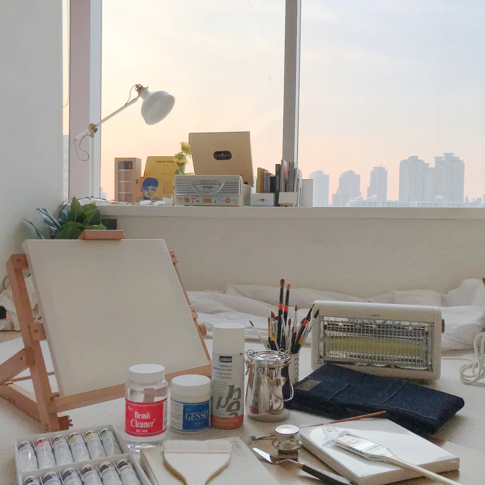

# 내일의 집

- 김버그의 UI 개발 부트캠프 강의 프로젝트
- 오늘의집 UI 클론
- Sass(SCSS) 수업
- lnb 반응형으로 할 때 버그있음. 나중에 잡기
  <br/><br/>

### 1. GNB

- 로그인을 하지 않은 경우

```html
<div class="button-group">
  <button
    class="gnb-icon-button is-search lg-hidden"
    type="button"
    aria-label="검색창 열기 버튼"
  >
    <i class="ic-search" aria-hidden></i>
  </button>
  <a
    class="gnb-icon-button is-cart"
    href="/"
    aria-label="장바구니 페이지로 이동"
  >
    <i class="ic-cart" aria-hidden></i>
    <strong class="badge">5</strong>
  </a>
  <div class="gnb-auth sm-hidden">
    <a href="/">로그인</a>
    <a href="/">회원가입</a>
  </div>
</div>
```

- 로그인을 했을 경우

```html
<div class="button-group">
  <button
    class="gnb-icon-button is-search lg-hidden"
    type="button"
    aria-label="검색창 열기 버튼"
  >
    <i class="ic-search" aria-hidden></i>
  </button>

  <a
    class="gnb-icon-button sm-hidden"
    href="/"
    aria-label="스크랩북 페이지로 이동"
  >
    <i class="ic-bookmark" aria-hidden></i>
  </a>

  <a
    class="gnb-icon-button sm-hidden"
    href="/"
    aria-label="내 소식 페이지로 이동"
  >
    <i class="ic-bell" aria-hidden></i>
  </a>

  <a
    class="gnb-icon-button is-cart"
    href="/"
    aria-label="장바구니 페이지로 이동"
  >
    <i class="ic-cart" aria-hidden></i>
    <strong class="badge">5</strong>
  </a>

  <button
    class="gnb-avatart-button sm-hidden"
    type="button"
    aria-label="마이메뉴 열기 버튼"
  >
    <div class="avartar-32">
      
    </div>
  </button>
</div>
```

### 2. Sidebar

- 로그인을 하지 않은 경우

  ```html
  <div class="sidebar-auth">
    <a class="btn-outlined btn-40" href="/">로그인</a>
    <a class="btn-primary btn-40" href="/">회원가입</a>
  </div>
  ```

- 로그인을 한 경우

  ```html
  <div class="sidebar-user">
    <a href="/">
      <div class="avartar-32">
        
      </div>
      <strong class="username">사달라</strong>
    </a>
  </div>
  ```

### 3. Product-review

- 리뷰가 없을 경우

  ```html
  <section
    class="product-section product-review"
    id="product-review"
    role="tabpanel"
  >
    <header class="product-section-header">
      <h1 class="title">리뷰</h1>
      <strong class="badge" aria-label="0개">0</strong>
      <a class="text-button" href="/">리뷰쓰기</a>
    </header>

    <div class="product-section-content">
      <p class="review-empty">
        첫 리뷰를 남겨주세요!<br />
        최대 <strong>500P</strong>를 드립니다.
      </p>
    </div>
  </section>
  ```

- 리뷰가 있을 경우

  - 기본값

    ```html
    <section
      class="product-section product-review"
      id="product-review"
      role="tabpanel"
    >
      <header class="product-section-header">
        <h1 class="title">리뷰</h1>
        <strong class="badge" aria-label="566개">566</strong>
        <a class="text-button" href="/">리뷰쓰기</a>
      </header>

      <div class="product-section-content">
        <div class="review-scoreboard">
          <div class="score-summary">
            <strong class="average-score" aria-label="평점 4.8">4.8</strong>
            <div class="star-rating">
              <i class="ic-star is-active"></i>
              <i class="ic-star is-active"></i>
              <i class="ic-star is-active"></i>
              <i class="ic-star is-active"></i>
              <i class="ic-star is-active"></i>
            </div>
          </div>

          <div class="score-detail">
            <dl class="score-stats-list">
              <div class="is-active score-stats-item">
                <dt>5점</dt>
                <dd>
                  <div class="bar-graph" aria-hidden>
                    <div
                      class="active-bar"
                      style="width: 82.50883392226148%"
                    ></div>
                  </div>
                  <strong class="count" aria-label="467명">467</strong>
                </dd>
              </div>
              <div class="score-stats-item">
                <dt>4점</dt>
                <dd>
                  <div class="bar-graph" aria-hidden>
                    <div
                      class="active-bar"
                      style="width: 10.07067137809187%"
                    ></div>
                  </div>
                  <strong class="count" aria-label="87명">87</strong>
                </dd>
              </div>
              <div class="score-stats-item">
                <dt>3점</dt>
                <dd>
                  <div class="bar-graph" aria-hidden>
                    <div
                      class="active-bar"
                      style="width: 2.29681978798587%"
                    ></div>
                  </div>
                  <strong class="count" aria-label="13명">13</strong>
                </dd>
              </div>
              <div class="score-stats-item">
                <dt>2점</dt>
                <dd>
                  <div class="bar-graph" aria-hidden>
                    <div class="active-bar"></div>
                  </div>
                  <strong class="count" aria-label="0명">0</strong>
                </dd>
              </div>
              <div class="score-stats-item">
                <dt>1점</dt>
                <dd>
                  <div class="bar-graph" aria-hidden>
                    <div class="active-bar"></div>
                  </div>
                  <strong class="count" aria-label="0명">0</strong>
                </dd>
              </div>
            </dl>
          </div>
        </div>

        <ol class="review-list">
          <!-- 기본값 -->
          <li class="review-item">
            <article class="review-card">
              <header class="review-card-header">
                <h3 class="visually-hidden">김버그 님이 작성한 리뷰</h3>
                <a class="avartar-24" href="/">
                  
                </a>

                <div class="info">
                  <a class="username" href="/">
                    <strong>김버그</strong>
                  </a>

                  <div class="detail">
                    <div class="star-rating-13" aria-label="5.0점 / 5.0점">
                      <i class="ic-star is-active"></i>
                      <i class="ic-star is-active"></i>
                      <i class="ic-star is-active"></i>
                      <i class="ic-star is-active"></i>
                      <i class="ic-star is-active"></i>
                    </div>

                    <div class="misc">
                      <time datetime="2022-03-08">2022.03.08</time>
                      <span>내일의집 구매</span>
                    </div>
                  </div>
                </div>
              </header>

              <div class="review-card-body">
                <p>
                  집 전체를 데운다기보다는 틀어놓고 앞에 앉아있으면 따땃해지는
                  정도예요. 불 꺼놓고 난로 켜고 담요 덮은 채로 커피 마시면 아주
                  좋아요. 고양이도 좋아해요
                </p>
              </div>

              <footer class="review-card-footer">
                <button class="btn-outlined btn-32" type="button">
                  도움이 돼요
                </button>

                <p>
                  <strong><span>7</span>명</strong>에게 도움이 되었습니다.
                </p>
              </footer>
            </article>
          </li>
        </ol>

        <div class="pagination">
          <ol class="page-list">
            <li class="page-item is-active">
              <a href="">1</a>
            </li>
            <li class="page-item">
              <a href="">2</a>
            </li>
            <li class="page-item">
              <a href="">3</a>
            </li>
            <li class="page-item">
              <a href="">4</a>
            </li>
            <li class="page-item">
              <a href="">5</a>
            </li>
          </ol>
          <button class="page-control page-next">
            <i class="ic-chevron"></i>
          </button>
        </div>
      </div>
    </section>
    ```

  - 유저 이미지가 없는 경우

    ```html
    <li class="review-item">
      <article class="review-card">
        <header class="review-card-header">
          <h3 class="visually-hidden">우유파이 님이 작성한 리뷰</h3>
          <a
            class="avartar-24"
            href="/"
            aria-label="우유파이 님의 프로필로 이동"
          ></a>

          <div class="info">
            <a class="username" href="/">
              <strong>우유파이</strong>
            </a>

            <div class="detail">
              <div class="star-rating-13" aria-label="5.0점 / 5.0점">
                <i class="ic-star is-active"></i>
                <i class="ic-star is-active"></i>
                <i class="ic-star is-active"></i>
                <i class="ic-star is-active"></i>
                <i class="ic-star"></i>
              </div>

              <div class="misc">
                <time datetime="2022-03-08">2022.03.08</time>
                <span>내일의집 구매</span>
              </div>
            </div>
          </div>
        </header>

        <div class="review-card-body">
          <p>
            작업실에서 손이 시려워서 책상 위에 올려서 쓸걸로 골랐습니다!
            아주아주 뜨듯하고 크기도 적당하고 민트 사고싶엇지만 품절 ㅠㅠ
          </p>
        </div>

        <footer class="review-card-footer">
          <button class="btn-outlined btn-32" type="button">도움이 돼요</button>

          <p>
            <strong><span>7</span>명</strong>에게 도움이 되었습니다.
          </p>
        </footer>
      </article>
    </li>
    ```

  - 리뷰 이미지를 올린 경우

    ```html
    <li class="review-item">
      <article class="review-card">
        <header class="review-card-header">
          <h3 class="visually-hidden">고영희님이좋아합니다 님이 작성한 리뷰</h3>
          <a class="avartar-24" href="/">
            
          </a>

          <div class="info">
            <a class="username" href="/">
              <strong>고영희님이좋아합니다</strong>
            </a>

            <div class="detail">
              <div class="star-rating-13" aria-label="3.0점 / 5.0점">
                <i class="ic-star is-active"></i>
                <i class="ic-star is-active"></i>
                <i class="ic-star is-active"></i>
                <i class="ic-star"></i>
                <i class="ic-star"></i>
              </div>

              <div class="misc">
                <time datetime="2022-03-08">2022.03.08</time>
                <span>내일의집 구매</span>
              </div>
            </div>
          </div>
        </header>

        <div class="review-card-body">
          <div class="review-image">
            
          </div>
          <p>
            고양이가 좋아해요 ㅎㅎ 섬세한 온도조절이 안되는게 아쉽지만, 이 가격
            이 디자인이면 만족할 수 밖에 없어요 :) 좋습니다!
          </p>
        </div>

        <footer class="review-card-footer">
          <button class="btn-outlined btn-32" type="button">도움이 돼요</button>

          <p>
            <strong><span>7</span>명</strong>에게 도움이 되었습니다.
          </p>
        </footer>
      </article>
    </li>
    ```

  - 사용자가 도움됨을 체크, 도움됨 1+ 경우

    ```html
    <li class="review-item">
      <article class="review-card">
        <header class="review-card-header">
          <h3 class="visually-hidden">쿠쿠 님이 작성한 리뷰</h3>
          <a class="avartar-24" href="/">
            
          </a>

          <div class="info">
            <a class="username" href="/">
              <strong>쿠쿠</strong>
            </a>

            <div class="detail">
              <div class="star-rating-13" aria-label="5.0점 / 5.0점">
                <i class="ic-star is-active"></i>
                <i class="ic-star is-active"></i>
                <i class="ic-star is-active"></i>
                <i class="ic-star is-active"></i>
                <i class="ic-star is-active"></i>
              </div>

              <div class="misc">
                <time datetime="2022-03-08">2022.03.08</time>
                <span>내일의집 구매</span>
              </div>
            </div>
          </div>
        </header>

        <div class="review-card-body">
          <p>
            오래된 아파트 확장된 방이라 외풍이 너무 심해 급하게 구매했습니다!
            예약배송이라 10일 가까이 기다렸는데 너무너무 만족스러워요~ :) 방이
            큰 편이라 전체가 다 따뜻해지길 바라지도 않았고, 후기를 먼저 봤던터라
            크게 기대를 안햇었는데 기대 이상입니다. 틀어놓으면 확실히 방 공기가
            달라져요! 후끈!!! 까진 아니어도 차가운 공기가 따뜻해집니다~
            만족스러워요!!! 올 겨울 덕분에 떨지 않고 보낼 수 있을것 같습니당
          </p>
        </div>

        <footer class="review-card-footer">
          <button class="btn-primary btn-32" type="button">
            <i class="ic-check" aria-hidden></i>
            도움됨
          </button>

          <p>
            <strong><span>7</span>명</strong>에게 도움이 되었습니다.
          </p>
        </footer>
      </article>
    </li>
    ```

  - 사용자가 도움됨을 미체크, 도움됨 X 경우

    ```html
    <li class="review-item">
      <article class="review-card">
        <header class="review-card-header">
          <h3 class="visually-hidden">참치바나나 님이 작성한 리뷰</h3>
          <a class="avartar-24" href="/">
            
          </a>

          <div class="info">
            <a class="username" href="/">
              <strong>참치바나나</strong>
            </a>

            <div class="detail">
              <div class="star-rating-13" aria-label="2.0점 / 5.0점">
                <i class="ic-star is-active"></i>
                <i class="ic-star is-active"></i>
                <i class="ic-star"></i>
                <i class="ic-star"></i>
                <i class="ic-star"></i>
              </div>

              <div class="misc">
                <time datetime="2022-03-08">2022.03.08</time>
                <span>내일의집 구매</span>
              </div>
            </div>
          </div>
        </header>

        <div class="review-card-body">
          <p>가격 대비 만족합니다.</p>
        </div>

        <footer class="review-card-footer">
          <button class="btn-outlined btn-32" type="button">도움이 돼요</button>
        </footer>
      </article>
    </li>
    ```

### 4. Product-inquiry

- 문의가 없을 경우

  ```html
  <section
    class="product-section product-inquiry is-open"
    id="product-inquiry"
    role="tabpanel"
  >
    <header class="product-section-header">
      <h1 class="title">문의</h1>
      <strong class="badge" aria-label="0개">0</strong>
      <a class="text-button" href="/">문의하기</a>
      <button class="icon-button sm-only" type="button" aria-label="더보기">
        <i class="ic-chevron" aria-hidden></i>
      </button>
    </header>

    <div class="product-section-content">
      <p class="inquiry-empty">문의 내역이 없습니다.</p>
    </div>
  </section>
  ```

- 문의가 있는 경우

  - 기본값

    ```html
    <section
      class="product-section product-inquiry is-open"
      id="product-inquiry"
      role="tabpanel"
    >
      <header class="product-section-header">
        <h1 class="title">문의</h1>
        <strong class="badge" aria-label="96개">96</strong>
        <a class="text-button" href="/">문의하기</a>
        <button class="icon-button sm-only" type="button" aria-label="더보기">
          <i class="ic-chevron" aria-hidden></i>
        </button>
      </header>

      <div class="product-section-content">
        <ol class="inquiry-list">
          <li class="inquiry-item">
            <article class="inquiry-card">
              <header class="inquiry-card-header">
                <dl class="detail">
                  <dt class="visually-hidden">구매 여부</dt>
                  <dd>구매</dd>
                  <dt class="visually-hidden">문의 유형</dt>
                  <dd>상품</dd>
                  <dt class="visually-hidden">답변 여부</dt>
                  <dd>미답변</dd>
                </dl>
                <h3 class="visually-hidden">지* 님이 남기신 문의</h3>
                <div class="misc">
                  <strong>지*</strong>
                  <time datetime="2021-01-08 12:34"
                    >2021년 1월 1일 12시 34분</time
                  >
                </div>
              </header>

              <div class="inquiry-card-body">
                <div class="inquiry-content question-content">
                  <span aria-label="문의 내용">Q</span>
                  <p>
                    상품받았는데 사용하면서 보니까 불들어오는곳 옆에 하얀 부분이
                    갈색으로 얼룩져있는데 불량인가요...? 위험하지는 않겠죠?
                    다른분들 후기사진에는 다 깨끗한 것 같아서요!
                    사진첨부가없어서 텍스트로 설명하려 하니 애매하네요ㅠㅠ
                  </p>
                </div>
              </div>
            </article>
          </li>
        </ol>

        <div class="pagination">
          <ol class="page-list">
            <li class="page-item is-active">
              <a href="">1</a>
            </li>
            <li class="page-item">
              <a href="">2</a>
            </li>
            <li class="page-item">
              <a href="">3</a>
            </li>
            <li class="page-item">
              <a href="">4</a>
            </li>
            <li class="page-item">
              <a href="">5</a>
            </li>
          </ol>
          <button class="page-control page-next">
            <i class="ic-chevron"></i>
          </button>
        </div>
      </div>
    </section>
    ```

  - 비밀글일 경우

    ```html
    <!-- NOTE: 비밀글일 경우 -->
    <li class="inquiry-item">
      <article class="inquiry-card">
        <header class="inquiry-card-header">
          <dl class="detail">
            <dt class="visually-hidden">구매 여부</dt>
            <dd>비구매</dd>
            <dt class="visually-hidden">문의 유형</dt>
            <dd>상품</dd>
            <dt class="visually-hidden">답변 여부</dt>
            <dd>미답변</dd>
          </dl>
          <h3 class="visually-hidden">홍* 님이 남기신 문의</h3>
          <div class="misc">
            <strong>홍*</strong>
            <time datetime="2021-01-08 12:34">2021년 1월 1일 12시 34분</time>
          </div>
        </header>

        <div class="inquiry-card-body">
          <div class="inquiry-content question-content">
            <span aria-label="문의 내용">Q</span>
            <p>
              <i class="ic-lock" aria-hidden></i>
              비밀글입니다.
            </p>
          </div>
        </div>
      </article>
    </li>
    ```

  - 답변이 달린 경우

    ```html
    <!-- NOTE: 답변이 달린 경우 -->
    <li class="inquiry-item">
      <article class="inquiry-card">
        <header class="inquiry-card-header">
          <dl class="detail">
            <dt class="visually-hidden">구매 여부</dt>
            <dd>구매</dd>
            <dt class="visually-hidden">문의 유형</dt>
            <dd>배송</dd>
            <dt class="visually-hidden">답변 여부</dt>
            <dd class="is-answered">답변완료</dd>
          </dl>
          <h3 class="visually-hidden">화이트팬*** 님이 남기신 문의</h3>
          <div class="misc">
            <strong>화이트팬***</strong>
            <time datetime="2021-01-08 12:34">2021년 1월 1일 12시 34분</time>
          </div>
        </header>

        <div class="inquiry-card-body">
          <div class="inquiry-content question-content">
            <span aria-label="문의 내용">Q</span>
            <p>
              화이트 재입고 날짜 알려 주세요 그리고 4평 남짓 방에 두려고 하는데
              너무 가까울까요
            </p>
          </div>

          <div class="inquiry-content answer-content">
            <span aria-label="답변 내용">A</span>
            <div class="seller">
              <strong>OA</strong>
              <time datetime="2021-01-11 12:34">2021년 1월 11일 12시 34분</time>
            </div>
            <p>
              안녕하세요 고객님, 보아르입니다:) 현재 고객님의 주문 정보가
              확인되지 않아 바로 안내드리지 못하는 점 양해 부탁드립니다.
              문의하신 제품의 경우 현재 주문폭주로 인한 예약 판매중으로 순차
              발송 진행되고 있습니다. 주문 시 최대한 빠른 발송 진행될 수 있도록
              노력하겠습니다. 감사합니다.
            </p>
          </div>
        </div>
      </article>
    </li>
    ```

## Sass

### Sass 설치

_참고링크 : node-sass https://www.npmjs.com/package/node-sass_
<br/><br/>

1. 터미널에 node-sass install

   ```
   npm i node-sass
   ```

2. package.json 파일에 script 추가

   ```
   node-sass [options] <input> [output] Or: cat <input> | node-sass > output
   ```

   ```
   // 예시

   "sass": "node-sass -wr --source-map true styles/main.scss style.css"
   ```

3. 터미널에 npm 시작

   ```
   npm run 스크립트명
   ```

   ```
   // 예시

   npm run sass
   ```

4. Sass Lint extension 사용

   - 터미널에 install

     ```
     npm install -D stylelint stylelint-config-recess-order stylelint-config-standard stylelint-scss
     ```

   - .stylelintrc.json 생성 : https://gist.github.com/rohjs/3ea4235ea8f044f1acc27e8dc52d40c8

### Sass 사용

- 출력될 scss 파일에 다른 scss 파일 첨부하는 법

  ```scss
  @import './파일명'; // 확장자 생략가능
  ```

- reset, font 등 기반이 되는 scss 파일은 base 폴더에 \_파일명.scss 로 저장

- **$variable** : 변수 선언

  - 선언 방법

    ```scss
    $variable: value;
    ```

    ```scss
    // 예시

    $hello-1: 1; // 소문자 사용시 하이픈(-) 사용
    $HELLO_2: 2; // 대문자 사용시 언더바(_) 사용
    ```

  - 전역변수, 지역변수 구분 가능
  - value에 number, string, list 등 작성 가능
  - string은 반드시 따옴표('', "") 안에 작성
  - scss import시 가장 상단에 삽입
  - string과 변수 조합

    ```scss
    #{$변수명}
    ```

    ```scss
    //예시

    .col-sm-$i -> .col-sm-#{$i}
    ```

- **Map**

  - key: value 형태로 이뤄짐 (자바스크립트의 Object와 비슷)
  - 선언시

    ```
    $변수명: (
      key1: value1,
      key2: value2,
    )
    ```

  - 사용시

    ```scss
    map-get($변수명, $key);
    ```

- **@mixin**

  - 함수와 비슷하나, 코드를 반환함

  - **기본** 선언 및 사용

    ```scss
    // 선언
    @mixin mixin명() {
      // css 내용
    }

    // 사용
    selector {
      @include mixin명();
    }
    ```

  - **parameter** 선언 및 사용

    ```scss
    // 선언
    @mixin mixin명($parameter) {
      속성: $parameter;
    }

    // 사용
    selector {
      @include mixin명($parameter);
    }
    ```

    - parameter를 안쓸 경우를 대비하여 기본값을 작성해줌

      ```scss
      @mixin mixin명($parameter: 기본값) {
        속성: $parameter;
      }
      ```

      ```scss
      // 예시

      @mixin text-style($color: false) {
        @if (type-of($color) === color) {
          color: $color;
        }
        // color 값에 px이나 boolean 값이 출력되지 않게 하기 위해 if문 작성
      }
      ```

  - **@content**

    - mixin을 include시 mixin 내부에 코드를 작성하고 싶을 때 추가로 선언해줘야 하는 것

    - 예시

      ```scss
      // 선언시
      @mixin responsive($screen) {
        if ($screen == T) {
          @media screen and (min-width: 1200px) {
            @content;
          }
        }
      }

      // 사용시
      p {
        @include responsive(T) {
          font-size: 12px;
        }
      }

      // 결과값
      p {
        @media screen and (min-width: 1200px) {
          font-size: 12px;
        }
      }
      ```

- **placeholder**

  - 공통된 스타일을 묶어서 작성해줄 때 사용
  - 선언시

    ```scss
    %스타일명 {
      // 공통스타일 작성
    }
    ```

    ```scss
    // 예시
    %tag-base {
      font-size: 12px;
      height: 20px;
      padding: 0 6px;
    }
    ```

  - 사용시

    ```scss
    선택자 {
      @extent %스타일명;
    }
    ```

    ```scss
    // 예시
    .tag-red {
      @extent %tag-base;
      background-color: red;
    }
    ```

- **@function** : 함수 선언

  - mixin과 비슷하나, 코드가 아닌 값만 반환함

    ```scss
    @function 함수명() {
      @return 값;
    }
    ```

- 내장 함수

  - **percentage()** : 백분율 구하는 함수
  - **type-of()** : type 구하는 함수

- **@debug** : 디버그

  ```scss
  @debug;
  ```

  - 터미널에 값을 출력할 때 사용 (js에서 console 같은 역할)

- **for 반복문**

  ```scss
  @for 순서변수 from 시작순서 through 마지막순서 {
  }
  ```

  ```scss
  // 예시

  @for $i from 1 through 4 {
    @debug $i; // 결과값 1, 2, 3, 4
  }
  ```
